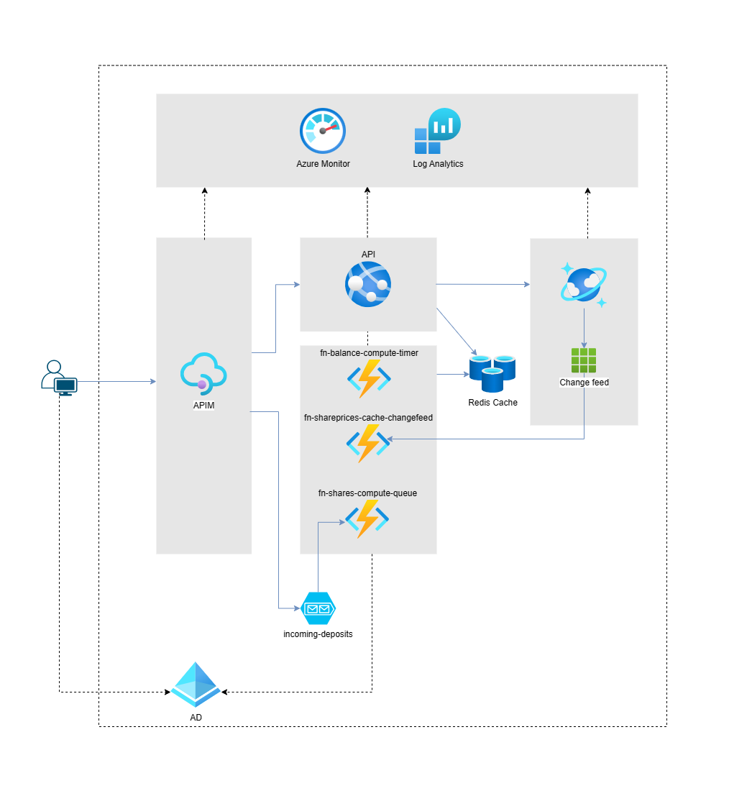
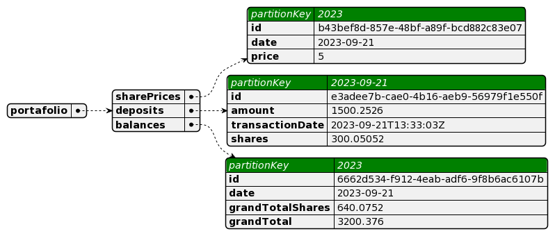
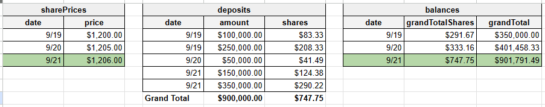
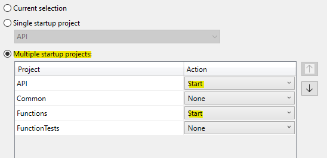
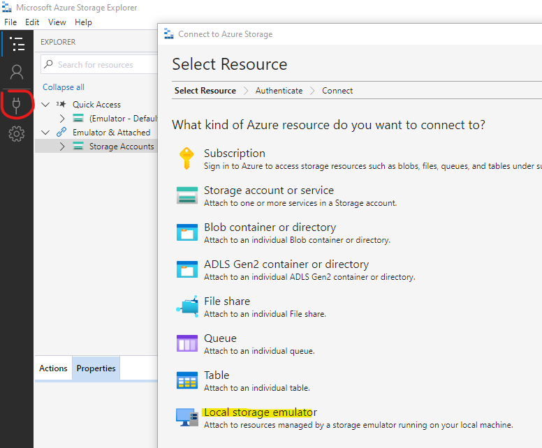
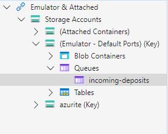
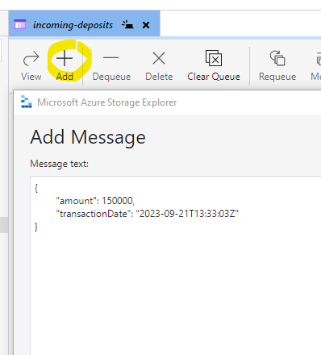

# Portafolio Management 
Para llevar a cabo la gestión de los fondos de nuestros clientes, transformamos los montos depositados en unidades denominadas "cuotas". Estas cuotas representan una fracción del patrimonio total administrado y  su valor fluctúa diariamente en función del rendimiento global de las inversiones realizadas por SF en el mercado financiero.

## Context diagram



|Component|Responsability|Remark|
|-|-|-|
|`API`|Administra cuotas diarias y consulta saldo del portafolio a una fecha especifica||
|`fn-balance-compute-timer`|Calcula saldos para una fecha especifica|Este proceso se ejecuta a una vez al final del dia, sin embargo para probar se creo otra función por http que ejecuta la misma logica|
|`fn-shareprices-cache-changefeed`|Actualiza cambios (inserts or updates) sobre las cuotas diarias en el cache||
|`fn-shares-compute-queue`|Calcula cuotas para el deposito y lo persiste en base de datos||
|`Cosmos' change feed`|Notifica cambios realizados en los containers|Se empleo una queue para darle escalabilidad y disponibilidad a este proceso|
|`Redis cache`|Almacena las cuotas diarias en memory|Cache distribuido para evitar accessos a bd innecesarios|

## Data model



## Balance's strategy

El saldo del portafolio se calcula de manera incremental empleando el ultimo saldo existente.

Ejemplo:



## Dependencies

* [Visual Studio 2022](https://visualstudio.microsoft.com/vs/community/) (lastest version) con azure development workload
* [Azure Cosmos DB Emulator](https://learn.microsoft.com/en-us/azure/cosmos-db/how-to-develop-emulator?tabs=windows%2Ccsharp&pivots=api-nosql)
* [MS Azure Storage Explorer](https://learn.microsoft.com/en-us/azure/storage/common/storage-use-emulator)
* [Redis](https://github.com/MicrosoftArchive/redis/releases)

## Getting started

### Configure startup projects

Establecer como projectos de inicio `API` y `Functions`, y proceder a ejecutar.



> Algunos errores pueden aparecer en la consola del proyecto de `Functions` mientras se crea la base de datos y sus contenedores.

Mediante **SwaggerUI** y empleando el endpoint `POST /api/share-prices` crear cuota diaria empleando el formato a continuación.

```json
{	
    "date": "2023-09-19",
    "price": 1200,    
}
```

### Adicionar depositos

Ejecutar **MS Azure Storage Explorer** y conectarse al `Local storage emulator (Azurite)`.



Crear queue con nombre `incoming-deposits`.



Y finalmente proceder a crear un deposito empleando el formato a continuación.

```json
{	
    "amount": 150000,
    "transactionDate": "2023-09-21T13:33:03Z"
}
```



### Ejecutar calculo de saldo

Para ejecutar la función de calculo de saldos emplear el endpoint `GET /api/compute-balance-adhoc` y pasar la fecha de cuota en la ruta.

```
curl -X 'GET' \
  'http://localhost:7078/api/compute-balance-adhoc/2023-09-22' \
  -H 'accept: application/json'    
```

Finalmente para consultar el saldo previamente calculado en **SwaggerUI** emplear el endpoint `POST api/balances` y proporcionar la fecha de cuota o el curl a continuación.

```
curl -X 'POST' \
  'https://localhost:7063/api/balances' \
  -H 'accept: application/json' \
  -H 'Content-Type: application/json' \
  -d '{
  "date": "2023-09-24"
}' 
```

## Items missing
- Consultar todos los valores de cuota desde el cache 
- Mover todos a funciones y elimanar Web API.
- Autenticación y autorización
